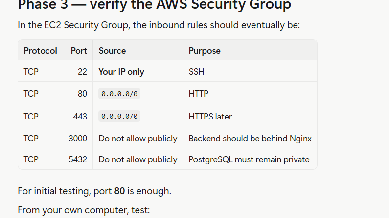

# ON AWS
 - scroll down
 - ensure auto public is enabled
 - click on securuty group, create security group
 -  name: production-webapp-sg
 - Description: Security group for production web application
 * Configure SSH
 - so in inbound rule, SSH - PORT 22 - SOurce- My IP
 * Add HTTP:  Type: HTTP - Port: 80 - Source: Anywhere ipv4
 * Add HTTPS: Type: HTTPS - Port: 443 - Source: Anywhere
 # SSH into your EC2

# while creating the instance
- leave these as default
- Network

- Subnet

- Auto-assign public IP -enable
- Firewall
- Security group
# Software on Your Windows Computer 
Git
VS Code
Docker Desktop
SSH

# First Linux administration exercise
Before installing Docker, let's behave like a DevOps engineer
- whoami
- hostname
- uname -a
- df -h
- free -h
- uptime
- ps aux

# Users and groups
 * Check your current user:
     - id 
 * Create a DevOps-style deployment user:
 - sudo adduser deploy
 - sudo usermod -aG sudo deploy
 # Why create users?
In production, you don't want everyone administering servers as: root
# Linux permissions
* create:
 - mkdir ~/devops-test
 - touch ~/devops-test/test.txt
 * check:
 - ls -l ~/devops-test
 -  lsb_release -a  -  to check the versionbuntu
 -  nproc - to check CPU
 - lscpu | head -15
 - ps aux --sort=-%mem | head -15     check running system
 - ps aux --sort=-%cpu | head -15
 -  systemctl --type=service --state=running    check running systems
 - systemctl --type=service --state=running           check running services
 -  test -f /var/run/reboot-required && echo "REBOOT REQUIRED" || echo "NO REBOOT REQUIRED"                         reboot reqiurement
 * Reboot The Server:  *** System restart required ***
 #reboot
 - sudo reboot

 # Update Ubuntu :   Your server should receive current package/security updates before we start deploying applications.
 - sudo apt update
 - sudo apt upgrade -y
 # Install Docker
 - docker --version
 - sudo systemctl status 
 - sudo apt update
- sudo apt install -y docker.io
- sudo systemctl enable --now docker    (enable)
- docker --version
- sudo docker run hello-world   (test)
- # Check Git
- git --version
# sudo apt install -y git (if git is not installed)
# verify Docker can run containers
- sudo docker run hello-world
- git --version
# Check your GitHub project
- pwd
- ls -la
# Step 1 — Create the project
- mkdir task-manager
- cd task-manager
- mkdir frontend backend nginx
- ls -la
# Step 2 — Create the React frontend

Because Node.js isn't installed on the EC2 host, we'll use Docker to create the React application.

# First check that Docker can run Node:
- sudo docker run --rm node:22-alpine node --version     ( v22This confirms that we can use Node without installing it directly on Ubuntu.)
# Then create the React app
- from /task-manager
- run    sudo docker run --rm -it \
  -v "$(pwd)/frontend:/app" \
  -w /app \
  node:22-alpine \
  npm create vite@latest . -- --template react

- Eslint
- install with npm

# cd ~/task-manager
# expose Vite to the network.
* Stop the current server
- Ctrl + C
* Start Vite with --host
- npm run dev -- --host 0.0.0.0

# Since your goal is to run the React/Vite app on EC2, let's first install Node.js properly. Don't install the old Ubuntu npm package yet.

# 1. Add Node.js 22 repository
- curl -fsSL https://deb.nodesource.com/setup_22.x | sudo -E bash -
# 2. Install Node.js
 - cd ~  (go to home)
 # 2. Install Node.js
 - sudo apt install -y nodejs
 - node -v
 - npm -v
 # Then return to your project
 - cd ~/task-manager
 - ls   check files
 # Enter the frontend
 - Enter the frontend
 - cd ~/task-manager/frontend
 - ls -la
 # Check package.json
 - cat package.json
 # Install dependencies
 - npm install
 # start the frontend
 - npm run dev -- --host 0.0.0.0
 - sudo chown -R ubuntu:ubuntu ~/task-manager
 - delete broken dependencies:   rm -rf ~/task-manager/frontend/node_modules
rm -f ~/task-manager/frontend/package-lock.json
 - cd ~/task-manager/frontend
 - ls -la
 - npm install
 - npm run dev -- --host 0.0.0.0
 - http://18.xxx.xxx.xxx:5173
 - ctl +c
 - add port 5173   custom TCP 5173 YOUR IP
 # Build the Task Manager App
 - task-manager/
├── backend/
├── frontend/
│   ├── src/
│   │   ├── App.jsx
│   │   └── ...
│   ├── package.json
│   └── vite.config.js
└── nginx/

# Inspect existing APP.jsx
- on EC2 Server 
- cd ~/task-manager/frontend
cat src/App.jsx
- cat package.json
- find . -maxdepth 2 -type f | sort
# Backend
# Create Nodejs Backend
* Create the Node.js backend
 - cd ~/task-manager/backend
- npm init -y
# Then install Express and CORS:
- npm install express cors
# Install nodemon for development:
- npm install --save-dev nodemon
# Step 2 — Create server.js
- nano server.js
# paste this:
const express = require("express");
const cors = require("cors");

const app = express();
const PORT = process.env.PORT || 5000;

app.use(cors());
app.use(express.json());

let tasks = [
  {
    id: 1,
    title: "Learn Docker",
    description: "Complete Docker fundamentals",
    completed: false,
  },
  {
    id: 2,
    title: "Deploy application",
    description: "Deploy Task Manager to AWS",
    completed: false,
  },
];

// Health check
app.get("/api/health", (req, res) => {
  res.json({
    status: "OK",
    message: "Task Manager API is running",
  });
});

// Get all tasks
app.get("/api/tasks", (req, res) => {
  res.json(tasks);
});

// Create a task
app.post("/api/tasks", (req, res) => {
  const { title, description } = req.body;

  if (!title) {
    return res.status(400).json({
      message: "Task title is required",
    });
  }

  const task = {
    id: Date.now(),
    title,
    description: description || "",
    completed: false,
  };

  tasks.push(task);

  res.status(201).json(task);
});

// Update a task
app.put("/api/tasks/:id", (req, res) => {
  const id = Number(req.params.id);

  const task = tasks.find((task) => task.id === id);

  if (!task) {
    return res.status(404).json({
      message: "Task not found",
    });
  }

  const { title, description, completed } = req.body;

  if (title !== undefined) task.title = title;
  if (description !== undefined) task.description = description;
  if (completed !== undefined) task.completed = completed;

  res.json(task);
});

// Delete a task
app.delete("/api/tasks/:id", (req, res) => {
  const id = Number(req.params.id);

  const taskExists = tasks.some((task) => task.id === id);

  if (!taskExists) {
    return res.status(404).json({
      message: "Task not found",
    });
  }

  tasks = tasks.filter((task) => task.id !== id);

  res.json({
    message: "Task deleted successfully",
  });
});

app.listen(PORT, "0.0.0.0", () => {
  console.log(`Task Manager API running on port ${PORT}`);
});

# Step 3 — Update package.json
 -nano package.json
 # replace it with:
 {
  "name": "task-manager-backend",
  "version": "1.0.0",
  "description": "Task Manager API",
  "main": "server.js",
  "scripts": {
    "start": "node server.js",
    "dev": "nodemon server.js"
  },
  "dependencies": {
    "cors": "^2.8.5",
    "express": "^5.1.0"
  },
  "devDependencies": {
    "nodemon": "^3.1.10"
  }
}

# Step 4 — Start the backend
 - npm run dev
 # Step 5 — Test the API
 * Open a second SSH terminal and run:
 - curl http://localhost:5000/api/health
 - curl http://localhost:5000/api/tasks
 # Next: connect React to the API
 - # 1. Keep the backend running
 - Your first SSH terminal should continue running: npm run dev
 - Your first SSH terminal should continue running: Task Manager API running on port 5000
 # 2. Open another SSH terminal
 * SSH into the EC2 server again: ssh -i 'c:/Users/USER/Downloads/devops.pem' ubuntu@34.224.38.204
  - cd ~/task-manager/frontend
  # 3. Replace App.jsx
 - Run:
 # nano src/App.jsx
 - Delete everything in the file and paste:
  - import { useEffect, useState } from "react";
import "./App.css";

const API_URL = "http://34.224.38.204:5000/api";

function App() {
  const [tasks, setTasks] = useState([]);
  const [title, setTitle] = useState("");
  const [description, setDescription] = useState("");
  const [loading, setLoading] = useState(true);

  const fetchTasks = async () => {
    try {
      const response = await fetch(`${API_URL}/tasks`);
      const data = await response.json();
      setTasks(data);
    } catch (error) {
      console.error("Failed to fetch tasks:", error);
    } finally {
      setLoading(false);
    }
  };

  useEffect(() => {
    fetchTasks();
  }, []);

  const addTask = async (event) => {
    event.preventDefault();

    if (!title.trim()) return;

    try {
      const response = await fetch(`${API_URL}/tasks`, {
        method: "POST",
        headers: {
          "Content-Type": "application/json",
        },
        body: JSON.stringify({
          title,
          description,
        }),
      });

      const newTask = await response.json();

      setTasks((currentTasks) => [...currentTasks, newTask]);
      setTitle("");
      setDescription("");
    } catch (error) {
      console.error("Failed to add task:", error);
    }
  };

  const toggleTask = async (task) => {
    try {
      const response = await fetch(`${API_URL}/tasks/${task.id}`, {
        method: "PUT",
        headers: {
          "Content-Type": "application/json",
        },
        body: JSON.stringify({
          completed: !task.completed,
        }),
      });

      const updatedTask = await response.json();

      setTasks((currentTasks) =>
        currentTasks.map((item) =>
          item.id === updatedTask.id ? updatedTask : item
        )
      );
    } catch (error) {
      console.error("Failed to update task:", error);
    }
  };

  const deleteTask = async (id) => {
    try {
      await fetch(`${API_URL}/tasks/${id}`, {
        method: "DELETE",
      });

      setTasks((currentTasks) =>
        currentTasks.filter((task) => task.id !== id)
      );
    } catch (error) {
      console.error("Failed to delete task:", error);
    }
  };

  return (
    

      <header className="header">
        <h1>Task Manager</h1>
        
Manage your tasks from your AWS EC2 server.

      </header>

      <main className="container">
        <section className="task-form-card">
          <h2>Add New Task</h2>

          <form onSubmit={addTask}>
            <input
              type="text"
              placeholder="Task title"
              value={title}
              onChange={(event) => setTitle(event.target.value)}
            />

            <textarea
              placeholder="Task description"
              value={description}
              onChange={(event) => setDescription(event.target.value)}
            />

            <button type="submit">Add Task</button>
          </form>
        </section>

        <section className="tasks-card">
          

            <h2>My Tasks</h2>
            {tasks.length} tasks
          

          {loading ? (
            
Loading tasks...

          ) : tasks.length === 0 ? (
            
No tasks yet.

          ) : (
            

              {tasks.map((task) => (
                

                  

                    <h3>{task.title}</h3>
                    
{task.description}

                  

                  

                    <button onClick={() => toggleTask(task)}>
                      {task.completed ? "Undo" : "Complete"}
                    </button>

                    <button
                      className="delete"
                      onClick={() => deleteTask(task.id)}
                    >
                      Delete
                    </button>
                  

                

              ))}
            

          )}
        </section>
      </main>
    

  );
}

export default App;

# 4. Replace the CSS
- Run:
- nano src/App.css
# 5. Start the frontend
open port 5000
- npm run dev -- --host 0.0.0.0:  Type: Custom TCP
Port: 5000
Source: My IP
- refresh http://34.224.38.204:5173
# Current setup
✅ AWS EC2 Ubuntu server
✅ Node.js / npm
✅ React + Vite frontend
✅ Frontend accessible externally
✅ Port 5173 open
✅ Public EC2 IP working
# ✅ What you've achieved

Your Task Manager now has:

Create — add new tasks
Read — retrieve/display tasks
Update — mark tasks as complete
Delete — remove tasks
React/Vite frontend running on EC2
Node.js/Express backend communicating correctly
Database persistence confirmed by refreshing
AWS EC2 deployment working

# Next: Production Deployment
# we now improve the deployment architecture:
                    Internet
                       │
                       ▼
                ┌─────────────┐
                │    Nginx    │
                │   Port 80   │
                │   Port 443  │
                └──────┬──────┘
                       │
             ┌─────────┴─────────┐
             ▼                   ▼
       React Frontend       Node.js API
                              │
                              ▼
                         PostgreSQL
                  
# Add PostgreSQL support to the backend (using env vars, so it's Docker-ready from day one)
# Step 1 — Install PostgreSQL client library
- cd ~/task-manager/backend
npm install pg
# Step 2 — Install PostgreSQL server on the EC2 box (temporary, for testing)
- sudo apt update
sudo apt install -y postgresql postgresql-contrib
sudo systemctl start postgresql
sudo systemctl enable postgresql
# Step 3 — Create the database and a dedicated user, login into 
-  sudo -u postgres psql
# Inside the psql prompt, run:
CREATE DATABASE taskmanager;
CREATE USER taskuser WITH ENCRYPTED PASSWORD 'taskpass';
GRANT ALL PRIVILEGES ON DATABASE taskmanager TO taskuser;
\q
# Step 4 — Create a db.js file for the connection
- paste:

const { Pool } = require("pg");

const pool = new Pool({
  host: process.env.DB_HOST || "localhost",
  port: process.env.DB_PORT || 5432,
  user: process.env.DB_USER || "taskuser",
  password: process.env.DB_PASSWORD || "taskpass",
  database: process.env.DB_NAME || "taskmanager",
});

module.exports = pool;

# Step 5 — Create the tasks table
- sudo -u postgres psql -d taskmanager
# Step 6 — Rewrite server.js to use the database
- nano server.js
- replace all with:
const express = require("express");
const cors = require("cors");
const pool = require("./db");

const app = express();
const PORT = process.env.PORT || 5000;

app.use(cors());
app.use(express.json());

app.get("/api/health", (req, res) => {
  res.json({ status: "OK", message: "Task Manager API is running" });
});

app.get("/api/tasks", async (req, res) => {
  try {
    const result = await pool.query("SELECT * FROM tasks ORDER BY id");
    res.json(result.rows);
  } catch (err) {
    console.error(err);
    res.status(500).json({ message: "Server error" });
  }
});

app.post("/api/tasks", async (req, res) => {
  const { title, description } = req.body;
  if (!title) return res.status(400).json({ message: "Task title is required" });

  try {
    const result = await pool.query(
      "INSERT INTO tasks (title, description, completed) VALUES ($1, $2, false) RETURNING *",
      [title, description || ""]
    );
    res.status(201).json(result.rows[0]);
  } catch (err) {
    console.error(err);
    res.status(500).json({ message: "Server error" });
  }
});

app.put("/api/tasks/:id", async (req, res) => {
  const id = Number(req.params.id);
  const { title, description, completed } = req.body;

  try {
    const existing = await pool.query("SELECT * FROM tasks WHERE id = $1", [id]);
    if (existing.rows.length === 0) return res.status(404).json({ message: "Task not found" });

    const current = existing.rows[0];
    const result = await pool.query(
      "UPDATE tasks SET title = $1, description = $2, completed = $3 WHERE id = $4 RETURNING *",
      [
        title !== undefined ? title : current.title,
        description !== undefined ? description : current.description,
        completed !== undefined ? completed : current.completed,
        id,
      ]
    );
    res.json(result.rows[0]);
  } catch (err) {
    console.error(err);
    res.status(500).json({ message: "Server error" });
  }
});

app.delete("/api/tasks/:id", async (req, res) => {
  const id = Number(req.params.id);
  try {
    const result = await pool.query("DELETE FROM tasks WHERE id = $1 RETURNING *", [id]);
    if (result.rows.length === 0) return res.status(404).json({ message: "Task not found" });
    res.json({ message: "Task deleted successfully" });
  } catch (err) {
    console.error(err);
    res.status(500).json({ message: "Server error" });
  }
});

app.listen(PORT, "0.0.0.0", () => {
  console.log(`Task Manager API running on port ${PORT}`);
});

# restart it:
- npm run dev
# Step 7 — Test again
- open another SSH terminal and run:
- curl http://localhost:5000/api/tasks
# To fix error priviledge error: run from anywhere
- sudo -u postgres psql -d taskmanager
- GRANT ALL PRIVILEGES ON ALL TABLES IN SCHEMA public TO taskuser;
GRANT ALL PRIVILEGES ON ALL SEQUENCES IN SCHEMA public TO taskuser;
GRANT USAGE, CREATE ON SCHEMA public TO taskuser;
\q

# sanity check
- cd ~/task-manager/backend
- npm run dev
# from the other terminal run:
- curl http://localhost:5000/api/tasks
##### WHENEVER YOU RESTART YOU SERVER AND HAVE A CHANGE OF IP: UPDATE THE NEW IP ADDRESS IN THE FOLLOWING:
# 1. Update the frontend's API URL
- cd ~/task-manager/frontend
nano src/App.jsx

* Find this line near the top:
- const API_URL = "http://34.224.38.204:5000/api";  change it to new ip eg:     const API_URL = "http://3.95.219.160:5000/api";
- Save (Ctrl+O → Enter → Ctrl+X), then restart the frontend dev server if it's running (Ctrl+C, then):
- npm run dev -- --host 0.0.0.0
# 2. Update how you SSH in
- ssh -i 'c:/Users/USER/Downloads/devops.pem' ubuntu@3.95.219.160
# 3. Re-check your Security Group rule
- The "Custom TCP port 5000, source: My IP" rule you added earlier should still be fine as long as your own home/office IP hasn't changed — that rule is about who can reach the server, not the server's own IP. No change needed there unless your local IP also changed.
# 4. Visit the new frontend URL
- http://3.95.219.160:5173

# ### Next step: Dockerize the application
- AWS EC2
│
├── Docker
│   ├── Frontend container
│   ├── Backend container
│   └── PostgreSQL container
│
└── Nginx
    └── Reverse Proxy
    
## Docker → Docker Compose → Nginx → HTTPS → CI/CD with Jenkins/GitHub Actions
#  Step 1 — Check your project structure
 - In the new terminal, run: :   cd ~/task-manager
ls -la

# Your project Sturcture:
task-manager/
├── backend/
│   ├── db.js
│   ├── server.js
│   ├── package.json
│   └── package-lock.json
├── frontend/
│   ├── src/
│   ├── package.json
│   ├── package-lock.json
│   └── vite.config.js
└── nginx/

# Step 1 — Checking backend configuration
- Run this from: cd ~/task-manager/backend
- then: cat package.json
- cat db.js
- cat server.js

#### Step 1: Create standard Dockerfiles and configurations
1. Backend Dockerfile
Navigate to the backend directory:
-  cd ~/task-manager/backend
# Create Dockerfile: 
 - nano Dockerfile
  * Paste the following configuration:
  - FROM node:22-alpine

WORKDIR /app

COPY package*.json ./

RUN npm ci --omit=dev

COPY . .

EXPOSE 5000

CMD ["node", "server.js"]

## Create a .dockerignore file in ~/task-manager/backend:
- nano .dockerignore
- node_modules
npm-debug.log
.env

## 2. Frontend Multi-Stage Dockerfile
Navigate to the frontend directory:
-  cd ~/task-manager/frontend
 - Create Dockerfile: nano Dockerfile
 - paste:
 -  
 # Stage 1: Build static assets
FROM node:22-alpine AS builder

WORKDIR /app

COPY package*.json ./

RUN npm ci

COPY . .

RUN npm run build

# Stage 2: Serve static assets with Nginx
FROM nginx:alpine

COPY --from=builder /app/dist /usr/share/nginx/html

EXPOSE 80

CMD ["nginx", "-g", "daemon off;"]

#  Create a .dockerignore file in ~/task-manager/frontend:
- nano .dockerignore
- 
node_modules
dist
.env

#### Step 2: Configure Environment Variables & Docker Compose
Navigate back to the project root:
- cd ~/task-manager
# 1. Create .env file for secrets
- nano .env
 POSTGRES_USER=taskuser
POSTGRES_PASSWORD=taskpass
POSTGRES_DB=taskmanager
POSTGRES_PORT=5432

PORT=5000
DB_HOST=postgres
DB_PORT=5432
DB_USER=taskuser
DB_PASSWORD=taskpass
DB_NAME=taskmanager

# Create a .env.example to check into version control safely:
-  nano .env.example
# 2. Create docker-compose.yml
Create the Compose orchestration file in ~/task-manager:
- nano docker-compose.yml
- 
version: '3.8'

services:
  postgres:
    image: postgres:16-alpine
    container_name: taskmanager-db
    restart: unless-stopped
    environment:
      POSTGRES_USER: ${POSTGRES_USER}
      POSTGRES_PASSWORD: ${POSTGRES_PASSWORD}
      POSTGRES_DB: ${POSTGRES_DB}
    volumes:
      - postgres_data:/var/lib/postgresql/data
    networks:
      - app-network
    healthcheck:
      test: ["CMD-SHELL", "pg_isready -U ${POSTGRES_USER} -d ${POSTGRES_DB}"]
      interval: 5s
      timeout: 5s
      retries: 5

  backend:
    build:
      context: ./backend
      dockerfile: Dockerfile
    container_name: taskmanager-backend
    restart: unless-stopped
    ports:
      - "5000:5000"
    environment:
      PORT: ${PORT}
      DB_HOST: ${DB_HOST}
      DB_PORT: ${DB_PORT}
      DB_USER: ${DB_USER}
      DB_PASSWORD: ${DB_PASSWORD}
      DB_NAME: ${DB_NAME}
    depends_on:
      postgres:
        condition: service_healthy
    networks:
      - app-network

  frontend:
    build:
      context: ./frontend
      dockerfile: Dockerfile
    container_name: taskmanager-frontend
    restart: unless-stopped
    ports:
      - "80:80"
    depends_on:
      - backend
    networks:
      - app-network

volumes:
  postgres_data:

networks:
  app-network:
    driver: bridge

## # Step 3: Stop Native Services & Run Docker Compose
Before spinning up containers on ports 5000 and 80, stop native PostgreSQL or Node services currently binding those ports:
- 
 -    # Stop native PostgreSQL service running on EC2
sudo systemctl stop postgresql
sudo systemctl disable postgresql

# Stop any running node processes
killall node 2>/dev/null || true
### If You Want to Enable docker compose (V2)
To install docker-compose-plugin, set up the official Docker repository first:
- 

# 1. Add Docker's official GPG key
sudo apt-get update
sudo apt-get install -y ca-certificates curl gnupg
sudo install -m 0755 -d /etc/apt/keyrings
curl -fsSL https://download.docker.com/linux/ubuntu/gpg | sudo gpg --dearmor -o /etc/apt/keyrings/docker.gpg
sudo chmod a+r /etc/apt/keyrings/docker.gpg

# 2. Add the repository to Apt sources
echo \
  "deb [arch=$(dpkg --print-architecture) signed-by=/etc/apt/keyrings/docker.gpg] https://download.docker.com/linux/ubuntu \
  $(. /etc/os-release && echo "$VERSION_CODENAME") stable" | \
  sudo tee /etc/apt/sources.list.d/docker.list > /dev/null

# 3. Install the plugin
sudo apt-get update
sudo apt-get install -y docker-compose-plugin

### Now launch your container stack:
- cd ~/task-manager
docker compose up -d --build

### Permanent Fix (Run without sudo)
If you want to run docker compose without typing sudo every time, add your user to the docker group:
- 
# 1. Create docker group (if it doesn't already exist)
sudo groupadd docker

# 2. Add current user to the docker group
sudo usermod -aG docker $USER

# 3. Apply group changes to current session
newgrp docker
 ### Then run to Now launch your container stack:
 - docker compose up -d --build

 ## Verify service health:
 - docker compose ps

 ## Useful Monitoring & Debugging Commands
 - # Stream live logs for all running services
docker compose logs -f

# Stream logs for a single service (e.g., backend)
docker compose logs -f backend

# Restart all containers if you make configuration changes
docker compose restart

# Stop and remove all running containers
docker compose down

### Step 4: Database Initialization & Verification
Because this is a fresh PostgreSQL instance inside a container volume, create the schema for the tasks table:

- 
docker exec -i taskmanager-db psql -U taskuser -d taskmanager << 'EOF'
CREATE TABLE IF NOT EXISTS tasks (
  id SERIAL PRIMARY KEY,
  title VARCHAR(255) NOT NULL,
  description TEXT,
  completed BOOLEAN DEFAULT FALSE
);
EOF

## Verify backend functionality via internal network endpoint:
- curl http://localhost:5000/api/health
- curl http://localhost:5000/api/tasks

### Step 5: Validate System Resilience & Persistence
Run these validation tests to confirm high availability requirements:

# Test 1: Container Failure Recovery
- # Stop backend container
docker stop taskmanager-backend

# Observe automatic restart triggered by Docker daemon
docker ps

## Test 2: Host Reboot Recovery
- # Reboot the EC2 instance
sudo reboot
# Wait 60 seconds, re-SSH into the EC2 instance, and check running containers:
- docker ps
## Step 1: Start the Backend Container
Start the backend service up using Docker Compose:
- cd ~/task-manager
docker compose start backend
# Verify that all three containers are now active:
- docker ps

## Step 2: Test API and DB Persistence
Verify health check & data:
- curl http://localhost:5000/api/health
- curl http://localhost:5000/api/tasks
## Insert sample data:
- curl -X POST http://localhost:5000/api/tasks \
  -H "Content-Type: application/json" \
  -d '{"title":"Docker Test Task","description":"Verifying DB volume persistence"}'

# Verify the task was written to PostgreSQL:
- curl http://localhost:5000/api/tasks
## Step 3: Validate Automatic Recovery (The Right Way)
To test if Docker automatically restarts the backend on crash or reboot (without permanently stopping it), simulate an ungraceful crash:
# Force-kill the backend process inside the container:
- docker kill taskmanager-backend
- docker kill taskmanager-backend
# Check container status immediately:
- docker ps
# 1.Check Exit Status & Logs:1 min.Inspect why the backend container didn't auto-restart:
- docker ps -a
docker logs taskmanager-backend --tail 20

# Update Restart Policy
Ensure Auto-Recovery
   # Open your Compose file:
- nano ~/task-manager/docker-compose.yml
- Ensure restart: always is explicitly set under the backend service, and remove the deprecated version: '3.8' line at the top:

#  ###
-  backend:
    build: ./backend
    container_name: taskmanager-backend
    restart: always
    ports:
      - "5000:5000"

### Restart container and verify
- Apply the updated Compose configuration and bring the backend online:
       - docker compose up -d
      - docker ps
      - curl http://localhost:5000/api/health

### Retest Auto Recovery
-  Kill the backend process again to verify restart: always brings it back up:
 - docker kill taskmanager-backend
sleep 3
docker ps

# DEBUGGING:
# sTART the backend service
- docker compose up -d backend
docker ps

# Clean Up docker-compose.yml Syntax
# 2.Clean Up docker-compose.yml Syntax:Remove deprecation warning.Open your Compose configuration file:
- nano ~/task-manager/docker-compose.yml
 1. Remove the obsolete line version: '3.8' at the top of the file.

2. Change the frontend host port from 80:80 to 3000:80 so Nginx can bind to port 80.

3. Ensure restart: always is set under backend.
#   services:
  frontend:
    build: ./frontend
    container_name: taskmanager-frontend
    restart: always
    ports:
      - "3000:80"

  backend:
    build: ./backend
    container_name: taskmanager-backend
    restart: always
    ports:
      - "5000:5000"
# then apply the changes:
- docker compose up -d
# Install Nginx on the EC2 Host
 - Host Reverse Proxy
 # 3.Install Nginx on the EC2 Host:Host Reverse Proxy.Install Nginx to handle incoming traffic on port 80:
 - sudo apt update && sudo apt install -y nginx
sudo rm /etc/nginx/sites-enabled/default
sudo nano /etc/nginx/sites-available/taskmanager
# Paste the following server block to route /api/* to the backend container and /* to the React frontend container:
- server {
    listen 80 default_server;
    listen [::]:80 default_server;

    server_name _;

    location /api/ {
        proxy_pass http://127.0.0.1:5000/api/;
        proxy_http_version 1.1;
        proxy_set_header Upgrade $http_upgrade;
        proxy_set_header Connection 'upgrade';
        proxy_set_header Host $host;
        proxy_cache_bypass $http_upgrade;
        proxy_set_header X-Real-IP $remote_addr;
        proxy_set_header X-Forwarded-For $proxy_add_x_forwarded_for;
    }

    location / {
        proxy_pass http://127.0.0.1:3000/;
        proxy_http_version 1.1;
        proxy_set_header Upgrade $http_upgrade;
        proxy_set_header Connection 'upgrade';
        proxy_set_header Host $host;
        proxy_cache_bypass $http_upgrade;
    }
}

# 4.Enable & Test Nginx Configuration:Verify end-to-end routing.Enable the site configuration, test for syntax errors, and reload Nginx:
- sudo ln -s /etc/nginx/sites-available/taskmanager /etc/nginx/sites-enabled/
sudo nginx -t
sudo systemctl reload nginx

# Test routing through Nginx on port 80:
- curl -I http://localhost/
curl http://localhost/api/tasks

# External Access & Verification
To verify access outside of the EC2 terminal, open your desktop browser or run curl locally from your Windows machine:

-  # In Git Bash on your desktop:
curl http://3.95.219.160/api/tasks

# On the browser:
- http://3.95.219.160/
======================================================================
wesome! Your Task Manager application is up, fully containerized, routed through Nginx on port 80, and talking to your PostgreSQL database cleanly. That completes a solid production-style architecture on EC2.

Here is a look at what you have successfully put in place:

React Frontend: Running containerized and served through Nginx.

Node.js Backend: Running containerized, handling /api/ endpoints.

PostgreSQL: Running containerized with persistent storage.

Host Nginx: Acting as your single entry point on Port 80.
# #### DEBUGGING CRUD NOT FUNCTIONING
- Step 1: Update API Endpoint in Frontend Code
In your frontend source code (e.g., src/App.js, src/api.js, or .env), change hardcoded port 5000 URLs to relative paths:

Incorrect: [http://3.95.219.160:5000/api/tasks](http://3.95.219.160:5000/api/tasks) or http://localhost:5000/api/tasks

Correct: /api/tasks

Example using fetch:

JavaScript
####
- // BEFORE
fetch('http://3.95.219.160:5000/api/tasks')

// AFTER
fetch('/api/tasks')

=============================================================- 
# How to Find the Exact Config File Nginx Is Using:  Steps to Edit Your Config
- sudo nginx -t
- sudo nano /etc/nginx/sites-available/default
- Locate the existing server { ... } block and add your backend reverse proxy rule:

server {
    listen 80;
    server_name 3.95.219.160;

    # Serves your React build files
    location / {
        root /home/ubuntu/task-manager/frontend/dist; # or /var/www/html
        index index.html;
        try_files $uri $uri/ /index.html;
    }

    # Proxies API requests to Node/Express on port 5000
    location /api/ {
        proxy_pass http://127.0.0.1:5000/api/;
        proxy_http_version 1.1;
        proxy_set_header Upgrade $http_upgrade;
        proxy_set_header Connection 'upgrade';
        proxy_set_header Host $host;
        proxy_cache_bypass $http_upgrade;
    }
}

- Save the file (Ctrl + O,
 press Enter), then exit (Ctrl + X).
 - Verify your changes and reload Nginx:
  - sudo nginx -t
sudo systemctl reload nginx

# Check which Nginx config files exist and are active:
- ls -la /etc/nginx/sites-enabled/
# Verify if your location /api/ changes are present inside the file:
- grep -A 10 "location /api" /etc/nginx/sites-available/default

Reload Nginx so it picks up the changes in taskmanager:
- sudo systemctl restart nginx
=========================================================================================
=========================================================================================
==========================================================================================
# 
Just loggin in, New IP
===========================================================================================
# 1. SSH in with the new IP
- ssh -i 'c:/Users/USER/Downloads/devops.pem' ubuntu@<NEW_IP>

# 2. Make sure Postgres is running
- sudo systemctl status postgresql

# If it's not active:
- sudo systemctl start postgresql

# 3. Check nothing stale is already running
- ps aux | grep node
# If you see old node/nodemon processes from a previous session, kill them first:
-  sudo kill -9 <PID>
# start the Backend
- cd ~/task-manager/backend
npm run dev
# confirm you see "Task Manager API running on port 5000
# Open a second SSH terminal, update the frontend's API
- ssh -i 'c:/Users/USER/Downloads/devops.pem' ubuntu@<NEW_IP>
cd ~/task-manager/frontend
nano src/App.jsx

# update line 4
- const API_URL = "http://<NEW_IP>:5000/api";
# make vite accessible externally
*nano  vite.config.js:
- export default {
  server: {
    host: '0.0.0.0', // or true
    port: 5173
  }
}
# go to inbound rule on AWS, add 5173, dource-my ip or anywhere 0000
# start the frontend
- npm run dev -- --host 0.0.0.0
# visit it in your browser
- http:..<newip>:5173
=========================================================
=========================================================
running crud working
==========================================================
=============================================================
We’ll first make the local Compose deployment reliable, then initialize GitHub and automate deployment.
+++++++++++++++++++++++++++++++++++++++++++++++++++++++++++++++++++++++++
Important HTTPS limitation
++++++++++++++++++++++++++++++++++++++++++++++++++++++
Because you are using an IP address temporarily:
HTTP can work immediately: http://YOUR_EC2_PUBLIC_IP
A trusted HTTPS certificate cannot normally be issued by Let’s Encrypt for a bare IP address.
Do not expose PostgreSQL publicly.
We can configure Nginx for HTTP now and add trusted HTTPS once you connect a domain.
A self-signed certificate is possible for testing, but browsers will show a certificate warning.
# Phase 1 — inspect the current deployment
Run these commands on the EC2 instance:
-  cd ~/task-manager

printf '\n--- docker versions ---\n'
docker --version
docker compose version

printf '\n--- compose file ---\n'
sed -n '1,240p' docker-compose.yml

printf '\n--- backend package ---\n'
cat backend/package.json

printf '\n--- backend server ---\n'
sed -n '1,260p' backend/server.js

printf '\n--- database module ---\n'
sed -n '1,260p' backend/db.js

printf '\n--- frontend package ---\n'
cat frontend/package.json

printf '\n--- nginx files ---\n'
find nginx -maxdepth 2 -type f -print -exec sed -n '1,240p' {} \;

#  Then validate the environment variable names only:
- cd ~/task-manager
sed 's/=.*//' .env
printf '\n--- expected variables ---\n'
sed 's/=.*//' .env.example
# Phase 2 — validate Docker Compose locally
* Before making changes, run:
- cd ~/task-manager

docker compose config
docker compose ps
docker compose logs --tail=100

# If the stack is not already running:
- docker compose up -d --build
# Then check the services:
- docker compose ps
# Check the backend from the EC2 host:
- curl -i http://localhost:3000/health
# If your backend uses a different port, identify it with:
- docker compose port backend 3000
# Check the frontend/Nginx endpoint:
- curl -I http://localhost
# Check recent service logs:
- docker compose logs --tail=100 backend
docker compose logs --tail=100 frontend
docker compose logs --tail=100 nginx
docker compose logs --tail=100 db

# Phase 3 — verify the AWS Security Group
In the EC2 Security Group, the inbound rules should eventually be:
- 

# From your own computer, test:
- http://YOUR_EC2_PUBLIC_IP

# Open in browser
- http://98.90.201.223/

# Phase 4 — initialize Git safely
  Once the Compose stack works, initialize the repository:
  - cd ~/task-manager

cat > .gitignore <<'EOF'
.env
.env.*
!.env.example

node_modules/
dist/
coverage/
*.log

docker-data/
postgres-data/

.DS_Store
.vscode/
.idea/
EOF

git init
git branch -M main
git add .
git status

# Before committing, confirm that .env is not listed in the staged files:
- git status --short
git diff --cached --name-only

# If .env appears, remove it from staging:
- git restore --staged .env

#  If .env appears, remove it from staging:
- git restore --staged .env

# Then commit:
- git commit -m "chore: establish production task manager foundation"

#### GitHub repository
Because no GitHub remote currently exists, create an empty GitHub repository. If GitHub CLI is authenticated on the EC2 instance, this can be done with:
- gh auth status
###  Step 1 — Install GitHub CLI

Since you're on Ubuntu, run:
- sudo apt update
sudo apt install gh -y

#  Then check:
- gh --version

### Step 2 — Log in to GitHub

Run:
- gh auth login
# You'll get questions. Choose:
GitHub.com
HTTPS
Login with a web browser
## If authenticated:
- gh repo create task-manager \
  --private \
  --source=. \
  --remote=origin \
  --push

## gh repo create task-manager --private --source=. --remote=origin --push

# 3. Confirm

Then run:
- git remote -v
#####  Excellent — the first milestone is complete.
Your project is now:
Running on EC2 with Docker Compose
Using PostgreSQL
Persisting its database through Docker
Running the backend on port 5000
Published to GitHub:
OnomeVera/task-manager

========================================
===========================================
### What we will add next
After the initial commands above, we will improve the project with:
- docker-compose.yml
├── frontend
│   ├── production build
│   └── healthcheck
├── backend
│   ├── health endpoint
│   ├── database retry logic
│   └── structured logs
├── postgres
│   ├── persistent named volume
│   ├── healthcheck
│   └── private-only network access
└── nginx
    ├── frontend routing
    ├── /api reverse proxy
    ├── security headers
    └── access/error logs

# Then we’ll add:
- .github/workflows/ci.yml
.github/workflows/deploy.yml
docs/architecture.md
README.md
.env.example

# The deployment workflow will:
Run frontend and backend checks.
Build the Docker images.
SSH to EC2.
Pull the latest main branch.
Rebuild and restart the Compose services.
Run health checks.
Fail the deployment if the application is unhealthy.
Run the inspection and Compose commands first and send me the output, excluding .env contents.

*****************************************************************************************************************************
******************************************************************************************************************************
#  Next phase: production hardening and CI/CD
Run this command on EC2 and send me the output:
- cd ~/task-manager

printf '\n--- docker-compose.yml ---\n'
cat docker-compose.yml

printf '\n--- backend/package.json ---\n'
cat backend/package.json

printf '\n--- backend/server.js ---\n'
cat backend/server.js

printf '\n--- backend/db.js ---\n'
cat backend/db.js

printf '\n--- backend/Dockerfile ---\n'
cat backend/Dockerfile

printf '\n--- frontend/Dockerfile ---\n'
cat frontend/Dockerfile

printf '\n--- nginx directory ---\n'
find nginx -maxdepth 3 -type f -print -exec sh -c 'echo "--- $1"; cat "$1"' _ {} \;

printf '\n--- current containers ---\n'
docker compose ps

### Also run these security checks
- cd ~/task-manager

printf '\n--- tracked secret check ---\n'
git ls-files | grep -E '(^|/)\.env($|\.)' || true

printf '\n--- public listening ports ---\n'
sudo ss -tulpn

printf '\n--- local endpoints ---\n'
curl -i http://localhost/
curl -i http://localhost:5000/health

++++++++++++++++++++++++++++++++++++++++++++++++
# Find your current public IP from your own computer:
- curl https://checkip.amazonaws.com
# Then set DDH rule to:
- YOUR_IP/32

#### Important HTTPS note
Because you currently use only an IP address, trusted HTTPS is not available yet through Let’s Encrypt.
For now:
- http://YOUR_EC2_PUBLIC_IP
# Once you have a domain, we will add:
 - https://your-domain.example
 # and and configure Certbot with automatic certificate renewal.
We should still reserve port 443 in the Security Group now.
------------------------------------------------------------------------------------------
## Step 1 — check the frontend API URL
On the EC2 instance, run:
- cd ~/task-manager

grep -RInE 'localhost|127\.0\.0\.1|:5000|/api' frontend/src frontend/.env* 2>/dev/null || true

# If you see URLs such as:
JavaScript
http://localhost:5000/api/tasks
change them to relative URLs:
JavaScript
/api/tasks
For example:
JavaScript
fetch("/api/tasks" )
This is required because the browser should call Nginx, and Nginx should forward /api/* to the backend container.

==========================================================
============================================================
# Your application is running, but the output identifies three important issues:
Frontend is exposed directly on port 3000.
Backend is exposed directly on port 5000.
The host Nginx is serving port 80, but it is not currently reverse-proxying API requests.
Also, this check was using the wrong endpoint:

# #### Current security status
The following ports are currently publicly listening:
text
80      host Nginx
3000    frontend container
5000    backend container
PostgreSQL is not publicly listening through Docker, which is good. We should now expose only:
text
80      Nginx
443     HTTPS later
The frontend and backend should communicate only through Docker’s private network.

*************
# Step 1 — check the frontend API URL
On the EC2 instance, run:
- cd ~/task-manager

grep -RInE 'localhost|127\.0\.0\.1|:5000|/api' frontend/src frontend/.env* 2>/dev/null || true

# Step 2 — create the reverse-proxy configuration
Create the Docker Nginx directory:
- cd ~/task-manager
mkdir -p nginx

# Create nginx/default.conf:
- cat > nginx/default.conf <<'EOF'
server {
    listen 80;
    server_name _;

    server_tokens off;

    client_max_body_size 10m;

    add_header X-Content-Type-Options "nosniff" always;
    add_header X-Frame-Options "SAMEORIGIN" always;
    add_header Referrer-Policy "strict-origin-when-cross-origin" always;

    location /api/ {
        proxy_pass http://backend:5000;
        proxy_http_version 1.1;

        proxy_set_header Host $host;
        proxy_set_header X-Real-IP $remote_addr;
        proxy_set_header X-Forwarded-For $proxy_add_x_forwarded_for;
        proxy_set_header X-Forwarded-Proto $scheme;

        proxy_connect_timeout 5s;
        proxy_read_timeout 30s;
    }

    location / {
        proxy_pass http://frontend:80;
        proxy_http_version 1.1;

        proxy_set_header Host $host;
        proxy_set_header X-Real-IP $remote_addr;
        proxy_set_header X-Forwarded-For $proxy_add_x_forwarded_for;
        proxy_set_header X-Forwarded-Proto $scheme;
    }

    location = /nginx-health {
        access_log off;
        default_type text/plain;
        return 200 "ok\n";
    }
}
EOF

# This gives us:
- /             → frontend container
/api/*        → backend container
/nginx-health → Nginx health check

### Step 3 — update Docker Compose
First, make a backup:
- cd ~/task-manager
cp docker-compose.yml docker-compose.yml.backup

# Open the Compose file:
- nano docker-compose.yml

#### Make these changes:
## Backend
-
* Remove the backend ports: section if it exists:
-ports:
  - "5000:5000"
( The backend should still have: expose:
  - "5000"
)

(or no port declaration at all. Docker services can still communicate through the private network)
 * Add a health check:
 - healthcheck:
  test: ["CMD", "node", "-e", "require('http' ).get('http://localhost:5000/api/health', r => process.exit(r.statusCode === 200 ? 0 : 1 )).on('error', () => process.exit(1))"]
  interval: 30s
  timeout: 5s
  retries: 3
  start_period: 10s

### Frontend
* Remove:
- ports:
  - "3000:80"
# The frontend should be reachable only by the Nginx container.
Add:
- healthcheck:
  test: ["CMD-SHELL", "wget --no-verbose --tries=1 --spider http://localhost/ || exit 1"]
  interval: 30s
  timeout: 5s
  retries: 3

### PostgreSQL
Keep the named volume:
- volumes:
  postgres_data:

# Do not run:
- docker compose down -v

That would delete the PostgreSQL data volume.
# Ensure PostgreSQL has a health check similar to:
- healthcheck:
  test: ["CMD-SHELL", "pg_isready -U ${DB_USER} -d ${DB_NAME}"]
  interval: 10s
  timeout: 5s
  retries: 5

### Add the Nginx service
Add this service under services::
-   nginx:
    image: nginx:1.28-alpine
    container_name: taskmanager-nginx
    restart: unless-stopped
    ports:
      - "80:80"
    volumes:
      - ./nginx/default.conf:/etc/nginx/conf.d/default.conf:ro
    depends_on:
      frontend:
        condition: service_healthy
      backend:
        condition: service_healthy
    networks:
      - app-network
    healthcheck:
      test: ["CMD-SHELL", "wget --no-verbose --tries=1 --spider http://localhost/nginx-health || exit 1"]
      interval: 30s
      timeout: 5s
      retries: 3

### your final service structure should now be:
- postgres
backend
frontend
nginx

# All services sould use:
- networks:
  - app-network
## so docker compose now looks like:

services:
  postgres:
    image: postgres:16-alpine
    container_name: taskmanager-db
    restart: unless-stopped
    environment:
      POSTGRES_USER: ${POSTGRES_USER}
      POSTGRES_PASSWORD: ${POSTGRES_PASSWORD}
      POSTGRES_DB: ${POSTGRES_DB}
    volumes:
      - postgres_data:/var/lib/postgresql/data
    networks:
      - app-network
    healthcheck:
      test: ["CMD-SHELL", "pg_isready -U ${POSTGRES_USER} -d ${POSTGRES_DB}"]
      interval: 5s
      timeout: 5s
      retries: 5

  backend:
    build:
      context: ./backend
      dockerfile: Dockerfile
    container_name: taskmanager-backend
    restart: unless-stopped
    expose:
      - "5000"
    environment:
      PORT: ${PORT}
      DB_HOST: postgres
      DB_PORT: 5432
      DB_USER: ${POSTGRES_USER}
      DB_PASSWORD: ${POSTGRES_PASSWORD}
      DB_NAME: ${POSTGRES_DB}
    depends_on:
      postgres:
        condition: service_healthy
    networks:
      - app-network
    healthcheck:
      test:
        [
          "CMD",
          "node",
          "-e",
          "require('http' ).get('http://localhost:5000/api/health', r => process.exit(r.statusCode === 200 ? 0 : 1 )).on('error', () => process.exit(1))"
        ]
      interval: 30s
      timeout: 5s
      retries: 3
      start_period: 10s

  frontend:
    build:
      context: ./frontend
      dockerfile: Dockerfile
    container_name: taskmanager-frontend
    restart: unless-stopped
    expose:
      - "80"
    depends_on:
      backend:
        condition: service_healthy
    networks:
      - app-network
    healthcheck:
      test: ["CMD-SHELL", "wget --no-verbose --tries=1 --spider http://localhost/ || exit 1"]
      interval: 30s
      timeout: 5s
      retries: 3

  nginx:
    image: nginx:1.28-alpine
    container_name: taskmanager-nginx
    restart: unless-stopped
    ports:
      - "80:80"
    volumes:
      - ./nginx/default.conf:/etc/nginx/conf.d/default.conf:ro
    depends_on:
      frontend:
        condition: service_healthy
      backend:
        condition: service_healthy
    networks:
      - app-network
    healthcheck:
      test: ["CMD-SHELL", "wget --no-verbose --tries=1 --spider http://localhost/nginx-health || exit 1"]
      interval: 30s
      timeout: 5s
      retries: 3

volumes:
  postgres_data:

networks:
  app-network:
    driver: bridge

#### Step 4 — stop the host Nginx
There is currently an Ubuntu host-level Nginx process listening on port 80. Stop and disable it before starting the Docker Nginx container:

- sudo systemctl stop nginx
sudo systemctl disable nginx

## Confirm port 80 is free: (If the command returns no output, port 80 is available.)
- sudo ss -tulpn | grep ':80' || true

# Step 5 — validate and restart safely
Run:
- cd ~/task-manager

docker compose config

#### Yes it worked!!!
### If the configuration is valid:
* run
- docker compose up -d --build

# Do not remove volumes.
Check status:
- docker compose ps

# You should eventually see:
taskmanager-postgres   healthy
taskmanager-backend    healthy
taskmanager-frontend   healthy
taskmanager-nginx      healthy

# Check logs:
docker compose logs --tail=100 nginx
docker compose logs --tail=100 backend
docker compose logs --tail=100 frontend

### Step 6 — test the new routing
Run these checks on EC2:
- curl -i http://localhost/nginx-health
curl -i http://localhost/api/health
curl -I http://localhost/

## expected
/nginx-health → HTTP 200
/api/health   → HTTP 200
/             → HTTP 200

### Then test from your own computer:
- curl -i http://98.90.201.223/nginx-health
curl -i http://98.90.201.223/api/health

## Open the application at:
- http://98.90.201.223

## The direct URLs below should no longer work publicly:
-= http://98.90.201.223:3000
http://98.90.201.223:5000

### Step 7 — commit the hardening changes
After the routing works:

- cd ~/task-manager

git status
git add docker-compose.yml nginx/default.conf frontend/src
git commit -m "chore: add private services behind nginx reverse proxy"
git push origin main

## Before committing, verify no secrets are tracked:
- git ls-files | grep -E '(^|/ )\.env($|\.)'

#  The only expected result should be:
- .env.example

===============================================================
Debuuging  CRUD NOT WORKING
=======================================================
# 1. Fix nginx/default.conf
Open it:
-nano nginx/default.conf

# Replace everything with

- server {
    listen 80;
    server_name _;

    location /api/ {
        proxy_pass http://backend:5000;
        proxy_http_version 1.1;

        proxy_set_header Host $host;
        proxy_set_header X-Real-IP $remote_addr;
        proxy_set_header X-Forwarded-For $proxy_add_x_forwarded_for;
        proxy_set_header X-Forwarded-Proto $scheme;
    }

    location / {
        proxy_pass http://frontend:80;
        proxy_http_version 1.1;

        proxy_set_header Host $host;
        proxy_set_header X-Real-IP $remote_addr;
        proxy_set_header X-Forwarded-For $proxy_add_x_forwarded_for;
        proxy_set_header X-Forwarded-Proto $scheme;
    }

    location = /nginx-health {
        access_log off;
        return 200 "healthy\n";
        add_header Content-Type text/plain;
    }
}

# Then reload the stack:
- docker compose up -d --build
docker compose restart nginx

